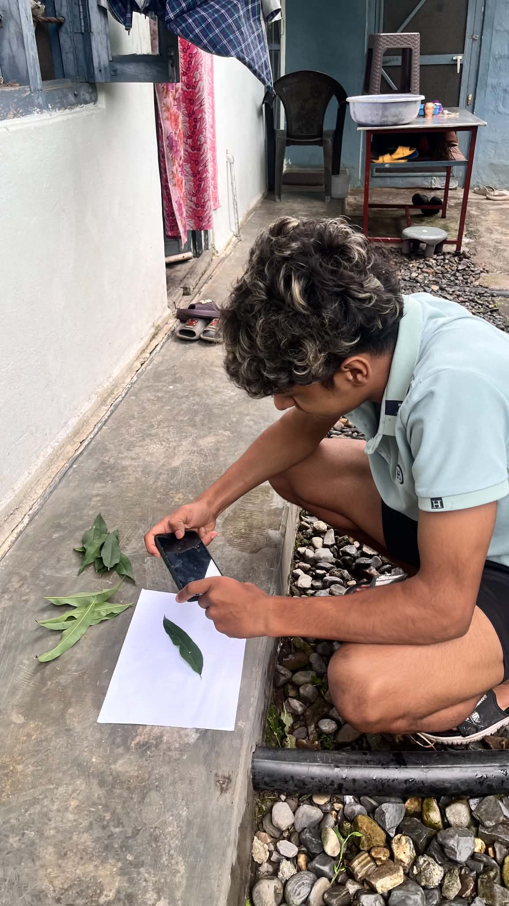

#  AI-Powered Crop Disease Detection System

A full‑stack web and mobile application that uses deep learning to identify crop diseases from leaf images and provides treatment recommendations, medicine suggestions, and Nepal‑specific cultivation advice.

---

##  Overview

Crop diseases cause 20–40% annual yield losses globally. Delayed or incorrect diagnosis in rural areas is the primary reason. This system empowers farmers to instantly identify diseases by uploading a leaf image via a **web browser** or **React Native mobile app**. It returns:

- Disease name & confidence
- Organic and chemical treatments
- Recommended medicines (with dosage & application method)
- Prevention tips & severity level
- **Nepal‑specific cultivation regions** (e.g., suitable areas for each crop)

The backend is built with **Flask** (Python) and exposes a RESTful API secured by **JWT**. The database (MySQL) stores 38 disease classes (across 14 crops), medicines, disease‑medicine mappings, user accounts, scan history, and admin logs.

---

##  Features

### For Farmers (Users)
- Register / Login with JWT
- Browse **crop‑wise disease library** (14 crops → 38 diseases) – view sample images, symptoms, treatments, medicines, cultivation areas
- Upload leaf image (camera / gallery) for instant prediction
- View scan history and favourite diseases
- Reset password via OTP email

### For Administrators
- Admin dashboard with system statistics (users, scans, diseases)
- View, search, activate/deactivate users
- Change user roles (user ↔ admin)
- View admin action logs

### Technical Highlights
- **ML model**: MobileNetV2 (transfer learning) trained on PlantVillage dataset – 90‑95% accuracy
- **Fallback model**: EfficientNetB0 (if MobileNetV2 fails to meet accuracy target)
- **Database**: 9 tables (users, diseases, medicines, mappings, scan_history, admin_logs, favorites, system_settings, password_resets)
- **Rich disease data**: organic/chemical treatments, medicine mapping (25+ medicines), **Nepal cultivation regions**, sample image URLs
- **Mobile app**: React Native with offline disease library and camera/gallery support
- **Web frontend**: Responsive HTML/CSS/JS with admin panel

---
### Dataset & Nepal‑Specific Cultivation Regions

The core disease classification model is trained on the PlantVillage dataset, which contains 54,303 labeled images of healthy and diseased leaves spanning 38 disease classes across 14 crop species (apple, blueberry, cherry, corn, grape, orange, peach, pepper, potato, raspberry, soybean, squash, strawberry, tomato). To make the system practically relevant for Nepal, we have extended the dataset with field‑adapted information: for every crop and disease, we added a cultivation_regions column that provides region‑specific advice on suitable growing areas within Nepal (e.g., “Terai: Jhapa, Morang, Sunsari; Mid‑hills: Kaski, Lalitpur; High hills: Jumla, Mustang”). This enhancement was based on Nepal’s agro‑ecological zones and expert agricultural knowledge. The complete dataset, including all 38 diseases with their symptoms, treatments, and Nepal‑specific cultivation regions, is available in the database/init.sql script. A detailed PDF document explaining the rationale, sources, and regional mapping is also uploaded to the GitHub repository (docs/datasetdiscription.pdf). This additional layer transforms the generic PlantVillage dataset into a context‑aware agricultural tool for Nepalese farmers.
##  Tech Stack

| Layer | Technology |
|-------|------------|
| Backend | Python 3.11, Flask, Flask‑SQLAlchemy, Flask‑JWT‑Extended, bcrypt |
| Database | MySQL 8.0, PyMySQL |
| ML Framework | TensorFlow 2.13, Keras, MobileNetV2 |
| Web Frontend | HTML5, CSS3, Vanilla JavaScript |
| Mobile App | React Native (Expo), Expo Image Picker, AsyncStorage |
| Deployment | Local (setup scripts provided) |

---

## Database Quick Start

The complete database schema with all initial data is provided in [`database/init.sql`](database/init.sql). It includes:

- 38 diseases (Apple, Blueberry, Cherry, Corn, Grape, Orange, Peach, Pepper, Potato, Raspberry, Soybean, Squash, Strawberry, Tomato)
- 25+ medicines (organic & chemical)
- Disease‑medicine mappings (56+ rows)
- Nepal‑specific cultivation regions for each disease
- Sample image URLs (placeholders – you need to place actual images in `backend/static/samples/`)
- Admin and test user accounts

To create the database:

```bash
mysql -u root -p < database/init.sql
```
---

### Web Frontend Authentication System
---

**Module:** Frontend Authentication Flow
**Date:** 29 May 2026

This document explains the complete frontend authentication workflow used in the Crop Disease Detection System.
The authentication process is implemented using three separate frontend pages:

1. `register.html` — User Registration Page
2. `verify-page.html` — Email OTP Verification Page
3. `login.html` — User Login Page

---

# Shared UI Components

All authentication pages contain common interface elements for consistency.

## Common Elements

* Dynamic page titles
* Current date display
* Responsive authentication layout
* Form validation messages
* Authentication branding section

## Example Titles

* Create Account
* Verify Email
* Welcome Back

## Date Format

```text
DD MMM YYYY
```

---

# 1. register.html — User Registration

## Overview

The registration page allows new users to create an account and begin the email verification process.

---

## Registration Form Fields

| Field              | Required |
| ------------------ | -------- |
| Full Name          | Yes      |
| Email Address      | Yes      |
| Phone Number       | Optional |
| District / Address | Optional |
| Password           | Yes      |
| Confirm Password   | Yes      |

---

## Registration Features

* Real-time password strength checking
* Password confirmation validation
* Required field validation
* Email verification initiation
* Responsive form design

---

## Registration Process

### Step 1 — User Enters Details

The user fills in the registration form with valid information.

---

### Step 2 — Frontend Sends API Request

```http
POST /api/auth/register
```

---

### Step 3 — Backend Registration Logic

The backend performs the following actions:

* Creates a new inactive user account
* Sets account status:

```text
is_active = false
email_verified = false
```

* Generates a 6-digit OTP code
* Sends verification OTP to the registered email address

---

### Step 4 — Redirect to Verification Page

After successful registration, the frontend redirects the user to:

```bash
verify-page.html?email=<email>
```

---

## Registration API Response

```json
{
  "requires_verification": true,
  "email": "user@example.com"
}
```

---

# 2. verify-page.html — Email Verification

## Overview

This page verifies the OTP sent to the user's email address and activates the account.

---

## Verification Inputs

* 6-digit OTP code
* Email address from URL query parameter

---

## Verification Features

* OTP auto-focus input fields
* OTP validation
* Resend verification code option
* 60-second resend cooldown timer
* Masked email display for privacy

---

## Verification Workflow

### Step 1 — Read Email from URL

Example:

```bash
?email=user@example.com
```

---

### Step 2 — User Enters OTP

The user enters the 6-digit verification code received via email.

---

### Step 3 — Send Verification Request

```http
POST /api/auth/verify-email
```

Request body:

```json
{
  "email": "user@example.com",
  "otp": "123456"
}
```

---

### Step 4 — Backend Activates Account

Backend updates account status:

```text
is_active = true
email_verified = true
```

---

### Step 5 — Redirect to Login Page

After successful verification:

```bash
login.html
```

The user receives a success confirmation message.

---

# Resend Verification Code

Users can request another OTP using:

```http
POST /api/auth/resend-verification
```

## Cooldown Protection

* 60-second cooldown timer
* Prevents OTP spam requests

---

# 3. login.html — User Login

## Overview

The login page allows verified users to securely access the system.

---

## Login Fields

| Field         | Required |
| ------------- | -------- |
| Email Address | Yes      |
| Password      | Yes      |

---

## Login Features

* JWT-based authentication
* Role-based dashboard redirection
* Email verification checking
* Forgot password support
* Secure token storage

---

## Login Workflow

### Step 1 — User Enters Credentials

The user submits email and password.

---

### Step 2 — Frontend Sends Login Request

```http
POST /api/auth/login
```

---

### Step 3 — Backend Validation

Backend validates:

* Email and password correctness
* Email verification status

```text
email_verified == true
```

---

# Handling Unverified Users

If the email is not verified:

* Backend automatically sends a new OTP
* Backend response:

```json
{
  "requires_verification": true
}
```

Frontend redirects user to:

```bash
verify-page.html
```

---

# Successful Login Response

Backend returns authentication tokens:

```json
{
  "access_token": "...",
  "refresh_token": "..."
}
```

Frontend stores tokens using:

```javascript
localStorage
```

---

# Dashboard Redirection

After successful login:

| User Role   | Redirect Page          |
| ----------- | ---------------------- |
| Normal User | `user-dashboard.html`  |
| Admin User  | `admin-dashboard.html` |

---

# Forgot Password Support

The login page includes password recovery functionality:

```bash
forgot-password.html
```

---

# Backend Authentication API Endpoints

| Endpoint                        | Method | Description             |
| ------------------------------- | ------ | ----------------------- |
| `/api/auth/register`            | POST   | Register new user       |
| `/api/auth/verify-email`        | POST   | Verify email OTP        |
| `/api/auth/resend-verification` | POST   | Resend verification OTP |
| `/api/auth/login`               | POST   | Authenticate user       |

---

# Integration Configuration

## Base API URL

```bash
http://localhost:5000/api
```

---

## Integration Notes

* Environment variables can be configured for deployment
* Email verification is mandatory before login
* Unverified login attempts automatically trigger OTP resend
* Authentication pages are reusable and modular
* Compatible with:

  * Web frontend
  * Mobile applications
  * External API integrations

---

# Authentication Flow Architecture

```text
register.html
      ↓
verify-page.html
      ↓
login.html
      ↓
dashboard
```

---

# Technology Stack

## Frontend Technologies

* HTML5
* CSS3
* JavaScript

## Backend Integration Technologies

* REST API
* JWT Authentication
* Email OTP Verification

---

# Security Features

* Password validation
* Email verification system
* JWT token authentication
* Protected dashboard access
* OTP expiration handling
* OTP resend cooldown protection
* Role-based authorization
* Secure authentication workflow
---

### Pilot Data Collection for Testing and Generalization

## **Date:** 30 May 2026

## Overview

This folder contains the pilot data collection samples used for testing the Crop Disease Detection System on unseen real-world images.

The purpose of this pilot dataset is to evaluate how well the trained model generalizes beyond the original PlantVillage training dataset. These images were collected separately from the training data and are used as ground-truth samples for model evaluation and performance validation.

---

# Objective

The primary objectives of this pilot data collection are:

* Evaluate model performance on unseen images
* Measure real-world generalization capability
* Verify disease classification accuracy
* Validate healthy vs diseased plant detection
* Create a ground-truth benchmark dataset
* Analyze prediction reliability outside the training environment

---

# Dataset Categories

The pilot dataset contains three categories of plant leaf images:

| Category       | Description                      |
| -------------- | -------------------------------- |
| Healthy Corn   | Healthy corn leaf samples        |
| Diseased Peach | Peach leaves affected by disease |
| Healthy Peach  | Healthy peach leaf samples       |

---

# Image Indexing Scheme

To simplify evaluation and ground-truth verification, all images have been indexed sequentially.

## Ground Truth Mapping

| Image Index Range | Ground Truth Class |
| ----------------- | ------------------ |
| 1 – 100           | Healthy Corn       |
| 101 – 200         | Diseased Peach     |
| 201 – 250         | Healthy Peach      |

---

# Purpose of Index-Based Labeling

The indexing system was designed to:

* Maintain consistent ground-truth records
* Simplify prediction analysis
* Support error tracking
* Enable confusion matrix generation
* Facilitate model performance evaluation
* Compare predicted labels against actual labels

---

# Testing Methodology

The pilot images are not part of the training dataset.

Instead, they are used exclusively for testing and validation to determine whether the model can successfully recognize plant species and disease conditions on previously unseen data.

Testing Process:

```text
Pilot Image
      ↓
Image Preprocessing
      ↓
Trained EfficientNet Model
      ↓
Prediction
      ↓
Ground Truth Comparison
      ↓
Performance Evaluation
```

---
# Pilot Data Collection - Proof of Work

This section provides visual proof of the pilot dataset used for testing and evaluating the model's generalization capability on unseen data.

The dataset includes **Healthy Corn**, **Healthy Peach**, and **Diseased Peach** samples, along with proof-of-collection images.

---

##  Healthy Corn Samples

<p align="center">


</p>

---

##  Peach Samples (Healthy & Diseased)

### Diseased Peach

<p align="center">


</p>

---

### Healthy Peach

<p align="center">


</p>

---

##  Proof of Data Collection

<p align="center">




</p>

---
# Ground Truth Verification

Each image index corresponds to a known class label.

Example:

```text
5.jpg  → Healthy Corn
145.jpg  → Diseased Peach
223.jpg  → Healthy Peach
```

This mapping allows accurate comparison between:

* Actual class (Ground Truth)
* Predicted class (Model Output)

---

# Importance of Pilot Testing

Pilot testing provides evidence that the model is capable of:

* Generalizing to new environments
* Handling unseen image samples
* Reducing dataset-specific bias
* Producing reliable real-world predictions
* Supporting deployment readiness

---

# Proof of Data Collection

This folder serves as documented proof of the pilot data collection process and contains representative image samples used during testing and evaluation.

The indexed images provide traceable references that can be used for:

* Accuracy assessment
* Result verification
* Research documentation
* Model validation experiments

---

# Conclusion

The pilot data collection dataset was created to assess the generalization performance of the Crop Disease Detection System on previously unseen plant leaf images. Through indexed ground-truth labeling and structured evaluation, the dataset provides a reliable benchmark for validating the effectiveness of the trained EfficientNet-based disease classification model in real-world scenarios.

Data collection is on going. Thank you. (Parallel work : Model is being train.....(We go through EfficentNet rather then MoblieNetv2).

Thank you !!.
---
### Crop Disease Detection System – Development Progress Update

# **Date:** 31 May 2026
--
## Overview

This update summarizes the work completed on the Crop Disease Detection System, including the pilot dataset evaluation conducted previously and the implementation of the User Dashboard, History Page, and User Backend APIs.

---

# Previous Work Summary

## Pilot Data Collection for Model Generalization Testing

A pilot testing dataset was created to evaluate the trained EfficientNet model on previously unseen plant leaf images.

### Dataset Categories

| Class          | Image Range |
| -------------- | ----------- |
| Healthy Corn   | 1 – 100     |
| Diseased Peach | 101 – 200   |
| Healthy Peach  | 201 – 250   |

### Purpose

* Evaluate model performance on unseen data
* Verify generalization capability
* Compare predictions against ground truth labels
* Create a testing benchmark separate from PlantVillage training data
* Validate real-world applicability of the model

### Proof of Work

The repository includes:

* Healthy corn sample images
* Diseased peach sample images
* Healthy peach sample images
* Pilot data collection evidence images
* Ground-truth indexing documentation

---

# User Dashboard Implementation

## File

```text
web-frontend/user-dashboard.html
```

## Overview

The User Dashboard serves as the primary interface for authenticated farmers and agricultural users.

It provides quick access to scan history, disease information, profile management, and crop disease resources.

---

## Key Features

### Statistics Overview

Displays:

* Total scans performed
* Average prediction confidence

Data Source:

```http
GET /api/user/statistics
```

---

### Recent Scan Activity

Shows:

* Disease name
* Confidence score
* Scan date

Displays the five most recent predictions.

Data Source:

```http
GET /api/user/history?page=1&per_page=5
```

---

### Crop Disease Library

Features:

* Search functionality
* Disease filtering
* Disease images
* Severity indicators
* Pagination support

Data Source:

```http
GET /api/user/diseases?per_page=100
```

---

### Profile Management

Users can:

* Update personal information
* Upload profile pictures
* Manage account settings

Data Sources:

```http
GET  /api/auth/me
PUT  /api/auth/update-profile
POST /api/auth/upload-profile-pic
```

---

### Account Controls

Accessible through the navigation menu:

* Edit Personal Details
* Change Password
* Delete Scan History
* Logout

---

# History Page Implementation

## File

```text
web-frontend/history.html
```

## Overview

The History Page provides a complete record of previous disease predictions made by the user.

---

## Features

### Prediction History Table

Displays:

* Leaf image thumbnail
* Disease name
* Confidence percentage
* Severity level
* Scan date

---

### Search Functionality

Allows filtering by disease name.

---

### Severity Filtering

Supported filters:

* High
* Medium
* Low

---

### Pagination

Displays:

* 10 records per page
* Backend-managed pagination

Data Source:

```http
GET /api/user/history?page=1&per_page=10
```

---

### Disease Detail Navigation

Selecting a history record redirects to:

```text
disease-detail.html?id=<disease_id>
```

for detailed disease information.

---

# Backend Development

## File

```text
backend/user.py
```

## Overview

The User Blueprint manages all user-specific operations under:

```text
/api/user
```

All routes require JWT authentication.

---

# Implemented API Endpoints

| Endpoint       | Method | Description              |
| -------------- | ------ | ------------------------ |
| /diseases      | GET    | Retrieve all diseases    |
| /diseases/<id> | GET    | Retrieve disease details |
| /predict       | POST   | Run disease prediction   |
| /history       | GET    | Retrieve scan history    |
| /history       | DELETE | Delete scan history      |
| /statistics    | GET    | Retrieve user statistics |

---

# Disease Prediction Pipeline

## Endpoint

```http
POST /api/user/predict
```

### Workflow

1. User uploads leaf image
2. Image is received through request.files
3. ML model performs inference
4. Prediction result is generated
5. Scan record is saved
6. Response returned to frontend

---

## Storage Process

Prediction results include:

* Disease name
* Confidence score
* Severity
* Recommendation
* Scan timestamp
* Uploaded image path

Images are stored in:

```text
uploads/
```

using UUID-based filenames.

---

# Scan History Management

## Delete History

Endpoint:

```http
DELETE /api/user/history
```

Features:

* Deletes all user scan records
* Returns deletion count
* Updates dashboard statistics

---

# Statistics Module

## Endpoint

```http
GET /api/user/statistics
```

Returns:

* Total scans
* Average confidence score

Implemented using SQLAlchemy aggregation functions:

* count()
* avg()

---

# Database Models Used

## User

Stores:

* User profile information
* Authentication data
* Profile image

---

## Disease

Stores:

* Disease details
* Crop type
* Symptoms
* Recommendations
* Treatment information

---

## ScanHistory

Stores:

* User ID
* Uploaded image
* Prediction result
* Confidence score
* Severity
* Scan timestamp

---

# Integration Notes

## Backend URL

```text
http://localhost:5000
```

---

## Authentication

All requests require:

```http
Authorization: Bearer <access_token>
```

The token is stored in:

```javascript
localStorage
```

after successful login.

---

## ML Model Integration (discused and ongoing)

The backend loads the prediction model through:

```text
ml_model.py
```

Capabilities:

* Disease prediction
* Crop identification
* Confidence scoring

Fallback mode is available if the trained model file is unavailable.

---

# Current Project Status

✅ User Authentication System

✅ Email Verification Workflow

✅ User Dashboard

Disease Library  (ongoing)

✅ Profile Management

✅ History Tracking

 Disease Prediction API(ongoing)

✅ Scan Statistics

 Pilot Dataset Collection(on going)

 Ground Truth Evaluation Dataset(ongoing)

EfficientNet-Based Crop Disease Classification Model (ongoing)

---

# Next Development Targets

* Disease Detail Enhancements
* Admin Dashboard Features
* Model Performance Reporting
* Confusion Matrix Evaluation
* Mobile Application Integration
* Production Deployment
* Cloud Storage Integration
* Real-Time Camera Detection
---
### Plant Disease Classification Model Training
-
### Date: 6/3/2026

Kaggle link : https://www.kaggle.com/code/bikramchapagain/projectmodel2

 Project Type: Deep Learning (Image Classification)  
 Architecture: EfficientNet-B3  
 Framework: PyTorch  

---

##  Project Overview

This project trains a deep learning model using EfficientNet-B3 architecture to classify plant diseases from leaf images.

The model is trained on the PlantVillage dataset containing:
- 38 total classes (24 diseases + 14 healthy categories)

Crops covered:
Apple, Blueberry, Cherry, Corn, Grape, Orange, Peach, Pepper, Potato, Raspberry, Soybean, Squash, Strawberry, Tomato

---

##  Dataset Information

Source: PlantVillage Dataset (Kaggle)  
Total Images: 5,403  
Total Classes: 38  

---

## Model Architecture

EfficientNet-B3 (pretrained on ImageNet)
↓
AdaptiveAvgPool2d
↓
Dropout (0.4)
↓
Linear (1536 → 512)
↓
GELU Activation
↓
Dropout (0.3)
↓
Linear (512 → 38)

---

##  Technologies Used

Python 3.10+  
PyTorch 2.0+  
torchvision  
EfficientNet-B3  
scikit-learn  
matplotlib  
pandas  
numpy  

---

## Training Pipeline

1. Data Preprocessing (224x224, normalization)
2. Data Augmentation (flip, rotation, color jitter)
3. Train/Val/Test split (70/15/15)
4. Model building (EfficientNet-B3)
5. Training with AdamW optimizer
6. Evaluation + metrics
7. Save best model

---

## Results

Validation Accuracy: 97.83%  
Training Accuracy: 97.11%  
Training Time: ~2.5 hours  

---

## How to Use

1. Clone repo
2. Install dependencies
3. Download PlantVillage dataset
4. Run train.ipynb
5. Save best_model.pth

---

## Prediction

Load trained model → preprocess image → get class + confidence score

---

## Credits

Dataset: PlantVillage (Kaggle)  
Model: EfficientNet (Google)  
Framework: PyTorch  

---
## Date: 6/3/2026
--
# Password Reset (`password_reset.py`) & Feedback (`feedback.py`)

## 1. Password Reset Module (`password_reset.py`)

The Password Reset module provides a secure password recovery mechanism using Email OTP (One-Time Password) verification. It allows users who have forgotten their passwords to reset them safely without requiring administrator intervention. The module integrates with the existing user authentication system and email service configuration.

### Features

#### Step 1: Request OTP

The user submits their registered email address. The system generates a six-digit OTP and sends it to the provided email address. The OTP remains valid for five minutes.

#### Step 2: Verify OTP

The user enters the OTP received via email. The system validates the OTP and generates a temporary reset token for the password reset process.

#### Step 3: Reset Password

After successful OTP verification, the user submits a new password. The system validates the password strength, updates the user's password, and invalidates the OTP.

---

### API Endpoints

| Endpoint                     | Method | Description                                           |
| ---------------------------- | ------ | ----------------------------------------------------- |
| `/api/auth/forgot-password`  | POST   | Sends an OTP to the user's registered email address.  |
| `/api/auth/verify-reset-otp` | POST   | Verifies the OTP and returns a temporary reset token. |
| `/api/auth/reset-password`   | POST   | Updates the user's password using the verified OTP.   |

---

### Request & Response Examples

#### Request OTP

**POST** `/api/auth/forgot-password`

```json
{
  "email": "user@example.com"
}
```

**Response (200)**

```json
{
  "message": "OTP sent to your email"
}
```

#### Verify OTP

**POST** `/api/auth/verify-reset-otp`

```json
{
  "email": "user@example.com",
  "otp": "123456"
}
```

**Response (200)**

```json
{
  "message": "OTP verified",
  "reset_token": "eyJhbGc..."
}
```

#### Reset Password

**POST** `/api/auth/reset-password`

```json
{
  "email": "user@example.com",
  "otp": "123456",
  "new_password": "NewStrongP@ssw0rd"
}
```

**Response (200)**

```json
{
  "message": "Password reset successful!"
}
```

---

### Security Features

* OTP expires automatically after 5 minutes.
* OTP values are stored securely in the user table.
* Temporary reset tokens use JWT and have a short validity period.
* Password complexity requirements include:

  * Minimum 8 characters
  * At least one uppercase letter
  * At least one lowercase letter
  * At least one numeric digit
  * At least one special character
* OTP becomes invalid immediately after successful password reset.

---

### Integration Requirements

* SMTP email configuration must be properly configured.
* Frontend implementation should follow a three-step flow:

  1. Email submission
  2. OTP verification
  3. New password creation
* After a successful reset, users should be redirected to the login page.

---

# 2. Feedback Module (`feedback.py`)

The Feedback module enables authenticated users to submit bug reports, feature requests, and general feedback directly from the application. Administrators can review, manage, and monitor submitted feedback through dedicated API endpoints.

### Features

* Submit feedback as an authenticated user.
* Report bugs and issues.
* Request new features and improvements.
* Send general suggestions or comments.
* Admin-only feedback management.
* Retrieve individual feedback details.
* Delete feedback entries.
* Extensible support for status updates and administrator responses.

---

### API Endpoints

| Endpoint             | Method | Description                                        |
| -------------------- | ------ | -------------------------------------------------- |
| `/api/feedback`      | POST   | Submit new feedback (requires JWT authentication). |
| `/api/feedback`      | GET    | Retrieve all feedback records (Admin only).        |
| `/api/feedback/<id>` | GET    | Retrieve a specific feedback entry (Admin only).   |
| `/api/feedback/<id>` | DELETE | Delete a feedback entry (Admin only).              |

---

### Submit Feedback Example

**POST** `/api/feedback`

```json
{
  "type": "bug",
  "subject": "Upload error",
  "message": "Predict page gives 500 error",
  "attachments": null
}
```

**Response (201)**

```json
{
  "id": 42,
  "message": "Feedback submitted. Thank you!"
}
```

---

### Retrieve Feedback (Admin)

**GET** `/api/feedback`

**Response (200)**

```json
{
  "feedback": [
    {
      "id": 42,
      "user_id": 5,
      "user_name": "roshan23",
      "type": "bug",
      "subject": "Upload error",
      "message": "Predict page gives 500 error",
      "status": "pending",
      "created_at": "2025-05-31T10:30:00Z"
    }
  ]
}
```

---

### Database Model Example

```python
class Feedback(db.Model):
    __tablename__ = 'feedback'

    id = db.Column(db.Integer, primary_key=True)
    user_id = db.Column(
        db.Integer,
        db.ForeignKey('users.id'),
        nullable=False
    )

    type = db.Column(db.String(20), nullable=False)
    subject = db.Column(db.String(200), nullable=False)
    message = db.Column(db.Text, nullable=False)

    status = db.Column(
        db.String(20),
        default='pending'
    )

    created_at = db.Column(
        db.DateTime,
        default=datetime.utcnow
    )

    user = db.relationship(
        'User',
        backref='feedback'
    )
```

---

### Administrator Requirements

* Administrative endpoints must verify:

  ```python
  current_user.role == 'admin'
  ```

* Feedback records can be:

  * Filtered by type
  * Filtered by status
  * Paginated for large datasets
  * Extended with response and resolution workflows

---

### Frontend Integration

A feedback section should be accessible from the user dashboard, preferably through the navigation menu or user profile dropdown.

Recommended form fields:

* Feedback Type (Bug / Feature / General)
* Subject
* Message
* Optional Attachment

After successful submission, the frontend should display a confirmation message or notification.

---

### Notes

* Both modules are designed to work independently and can be integrated without significant changes to the existing authentication or dashboard systems.
* Password reset functionality requires valid SMTP credentials and email service configuration.
* The implementation can be extended to support feedback replies, ticket tracking, and notification systems.
* API routes and behaviors should be updated if future changes are made to the backend architecture.

##  Contact

bikram204@gmail.com


